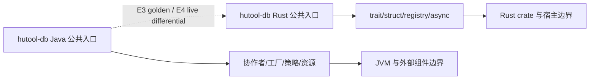

# hutool-db Java → Rust 全量迁移路线图

> 生成日期：2026-07-29
> Java 基线：`a0bd223dc0d036f55cfe4d8e2f5737ddc31f2b12`
> Rust 基线：`9f3215bf4c4df716831b18f32a57bca8eea68409`
> 最近按 Rust 基线审计：2026-07-29
> 文档状态：`DRAFT_AUDITED_STATIC`
> Java 模块：`hutool-db`
> Rust 目标：`crates/hutool-db`
> 兼容目标：公共 API、功能语义与可观察行为完整迁移；Rust 机制允许不同，但不得删减合同。
> CodeGraph：Java `files=2306 nodes=44769 edges=100575 db=117.46MB status=up-to-date`；Rust `files=2053 nodes=28492 edges=74236 db=80.38MB status=up-to-date`。
> 证据边界：CodeGraph 提供 E2 静态符号/关系证据；正则清单用于完整主对象盘点。二者都不是运行时差分证明，不能据此标记 `BEHAVIOR_VERIFIED`。
## 一、迁移目标与边界
本路线图以固定 Java SHA 的生产源码为合同来源，以固定 Rust SHA 的已有实现为继续迁移起点。本轮只制定与校准文档，不修改迁移代码；目标是最终达到对象、方法、参数、错误、数据格式、顺序、并发、I/O、副作用及宿主行为的可验证一致。
### 范围
| 范围 | Java 入口 | Rust 目标 | 完成门禁 |
|---|---|---|---|
| 生产对象 | `hutool-db/src/main/java` | `crates/hutool-db/src` | 每个对象、方法、重载、参数有去向 |
| 测试与夹具 | `hutool-db/src/test`（40 个 Java 测试文件） | `crates/hutool-db/tests`（10 个 Rust 集成测试文件） | SOURCE_PARITY 三本账 + E3/E4 差分 |
| Rust 已实现内容 | Java 对象分母不变 | 当前 58 个真实逻辑候选 | 不删除、不降级，补证据或增量修正 |
| 聚合/BOM | `hutool-all`、`hutool-bom` | `crates/hutool` facade | 聚合器不进入功能对象分母，单列治理 |

### 明确边界
| 项目 | 当前处置 | 原因 | 退出条件 |
|---|---|---|---|
| JVM 反射/类加载/动态代理 | `NOT_STARTED` 或 `IMPLEMENTED_UNVERIFIED`，不自动豁免 | 需逐合同映射 trait/registry/macro | 对象表逐项批准并有合同测试 |
| 文件存在但含占位宏 | `SKELETON` | 技能红线：不计实现 | 替换为真实逻辑并通过至少 E2，目标 E3/E4 |
| 已有 Rust 本地测试 | 最高 E1/E2 | 单端测试不等于差分 | 固定双 SHA 的 golden/live 比较 |

## 二、冻结基线与盘点
| 维度 | Java | Rust | 证据 |
|---|---:|---:|---|
| 生产对象主文件 | 87 | 64 | `rg --files .../src/main/java -g '*.java'`；`rg --files crates/hutool-db/src -g '*.rs'` |
| 公共/保护方法与构造器（静态解析） | 963 | 381 个 `pub fn` 候选 | 本表生成器正则清单；需语言级工具复核 |
| 测试文件 | 40 | 10 | 固定 SHA 工作树扫描 |
| 占位 Rust 文件 | — | 0 | `rg -l 'todo!\|unimplemented!' crates/hutool-db/src` |
| facade/mod/compat 内定义对象的文件 | — | 2 | 静态布局审计 |
| 已实现未验证 | — | 58 | 有真实代码，无双端差分 |
| 行为已验证 | — | 0 | 本轮未发现满足 E3/E4 且绑定当前双 SHA 的证据 |

## 三、设计与结构原则
1. 一个 Java 类、接口、枚举、record、注解或异常对应一个主要 `.rs` 文件。
2. `lib.rs`、`mod.rs` 只声明和重导出；`compat.rs` 只保留薄兼容入口。
3. Java 重载逐签名登记；Rust 使用 `_with_*`、`_from_*`、options、trait 或 builder 保留差异。
4. `null`、默认值、异常、集合顺序、数值精度、I/O、副作用、线程安全均属于合同。
5. 既有 Rust 实现不因结构不理想而删除；先锁定行为，再拆文件和补兼容层。
6. 第三方依赖只有声明状态，不因进入 Cargo.toml 就称为合同验证。

## 四、代表性高价值调用链
下列入口按公共方法数量选取，并以当前 CodeGraph 索引做符号位置与关系复核；动态分派、反射/SPI、错误副作用仍须后续 E3/E4 与真实宿主验证。

| Java 入口 | Rust 候选 | 当前状态 | 必须补齐的证据 |
|---|---|---|---|
| `cn.hutool.db.sql.StatementWrapper`（100 个公开/保护签名） | `crates/hutool-db/src/jdbc_wrapper/statement_wrapper.rs` | `IMPLEMENTED_UNVERIFIED` | 调用者、错误路径、副作用、源测试处置、E3/E4 差分 |
| `cn.hutool.db.AbstractDb`（66 个公开/保护签名） | `crates/hutool-db/src/runner/abstract_db.rs` | `IMPLEMENTED_UNVERIFIED` | 调用者、错误路径、副作用、源测试处置、E3/E4 差分 |
| `cn.hutool.db.ds.pooled.ConnectionWraper`（53 个公开/保护签名） | `crates/hutool-db/src/jdbc_wrapper/connection_wraper.rs` | `IMPLEMENTED_UNVERIFIED` | 调用者、错误路径、副作用、源测试处置、E3/E4 差分 |
| `cn.hutool.db.sql.SqlBuilder`（35 个公开/保护签名） | `crates/hutool-db/src/sql/sql_builder/sql_builder.rs` | `IMPLEMENTED_UNVERIFIED` | 调用者、错误路径、副作用、源测试处置、E3/E4 差分 |
| `cn.hutool.db.Entity`（33 个公开/保护签名） | `crates/hutool-db/src/entity.rs` | `IMPLEMENTED_UNVERIFIED` | 调用者、错误路径、副作用、源测试处置、E3/E4 差分 |
| `cn.hutool.db.meta.Column`（29 个公开/保护签名） | `crates/hutool-db/src/meta_types/column.rs` | `IMPLEMENTED_UNVERIFIED` | 调用者、错误路径、副作用、源测试处置、E3/E4 差分 |
| `cn.hutool.db.sql.Condition`（28 个公开/保护签名） | `crates/hutool-db/src/sql/condition/condition.rs` | `IMPLEMENTED_UNVERIFIED` | 调用者、错误路径、副作用、源测试处置、E3/E4 差分 |
| `cn.hutool.db.DaoTemplate`（25 个公开/保护签名） | `crates/hutool-db/src/dao_template/dao_template.rs` | `IMPLEMENTED_UNVERIFIED` | 调用者、错误路径、副作用、源测试处置、E3/E4 差分 |



## 五、组件替换账本
| 来源 | 当前声明 | 证据状态 | 采用限制/下一门禁 |
|---|---|---|---|
| Java POM 直接 artifact | `DmJdbcDriver18, HikariCP, beecp, c3p0, clickhouse-jdbc, commons-dbcp2, druid, h2, hsqldb, hutool-core, hutool-log, hutool-setting, jedis, mongodb-driver-sync, mssql-jdbc, mysql-connector-j, ngdbc, ojdbc8, postgresql, slf4j-simple, sqlite-jdbc, tomcat-jdbc` | `SOURCE_DECLARED` | 从 Java 调用链提取真实合同 |
| Rust Cargo 直接依赖 | `indexmap, num-bigint, regex, rust_decimal, serde, serde_json, sqlx, thiserror, tokio` | `DEPENDENCY_DECLARED` | license/MSRV/target/advisory + 风险 POC + 共享合同测试 |
| 团队映射策略 | std/serde/reqwest/sqlx/RustCrypto 等仅作起点 | `CANDIDATE_POLICY` | 不按名称机械采用；必须记录拒绝项与回滚方案 |

## 六、阶段与证据门禁
| 阶段 | 内容 | 当前状态 | 退出门禁 |
|---|---|---|---|
| S0 | 固定 SHA、对象/方法清单、四文档 | `IN_PROGRESS` | 四文档无 TODO、基线一致、可重算 |
| S1 | 一对象一文件与签名补齐 | `IN_PROGRESS` | 29 个缺失、0 个骨架归零；布局审计归零 |
| S2 | 纯逻辑、错误、序列化、集合/数值 | `PLANNED` | E2 镜像合同完整，wire/error 边界覆盖 |
| S3 | I/O、SPI、反射/注解替代 | `PLANNED` | 动态选择、资源释放、失败路径可执行 |
| S4 | 并发、异步、生命周期 | `PLANNED` | 取消、背压、超时、关闭与竞态门禁 |
| S5 | Java golden/live 差分 | `PLANNED` | 当前双 SHA 夹具元数据与差分结果 |
| S6 | 真实示例、业务宿主、负载、安全 | `PLANNED` | E4-E7 证据与阈值 |
| S7 | 灰度与回滚 | `PLANNED` | E8 演练、状态兼容和恢复时间 |

## 七、优先任务
| 优先级 | 工作项 | 数量/范围 | 验收 |
|---|---|---|---|
| P0 | 删除占位语义并实现真实逻辑 | 0 个 Java 对象候选 | 无 `todo!`/`unimplemented!`，有 E2 |
| P0 | 补齐无 Rust 对应对象 | 29 个 | 对象、方法、参数与来源注释完整 |
| P0 | 拆分 facade/mod/compat 对象 | 2 个含类型文件 | 一对象一文件，API 不回退 |
| P1 | 建立 Java 测试处置账 | 全部源测试 | SOURCE_PARITY 每项有 disposition |
| P1 | 建立 golden/live 导出器 | 高价值确定性 API | E3/E4 可重放 artifact |
| P2 | 并发、负载、fuzz、安全与宿主 | 风险驱动 | E5-E7 明确阈值 |

## 八、质量门禁
```bash
python3 "$SKILL_DIR/scripts/audit_migration_layout.py" --rust-root .
cargo check -p hutool-db --all-targets --all-features
cargo test -p hutool-db --all-targets --all-features
cargo fmt --all --check
cargo clippy --workspace --all-targets --all-features -- -D warnings
```

本轮静态布局审计结果为 `scanned=1781 errors=217 warnings=23 semantic_parity_proven=false`；该结果是路线图输入，不是本轮文档任务要掩盖的失败。

## 九、风险与回滚
| 风险 | 影响 | 对策 | 回滚/退出策略 |
|---|---|---|---|
| 旧文档把文件存在当完成 | 错误估计工期 | 统一七状态并清零无证据 VERIFIED | 回到本 SHA 清单重算 |
| 重载、默认值、异常被合并 | 调用方行为变化 | 每个 Java 签名单列，Rust 后缀命名 | 保留兼容 wrapper |
| 第三方 crate 合同不完整 | wire/生命周期/平台不兼容 | 硬门禁、风险 POC、共享合同测试 | trait 隔离、锁版本、可替换 adapter |
| 并发与 I/O 只做单元测试 | 泄漏、死锁、顺序错误 | E5-E7 与真实宿主 | feature gate/流量回切 |

## 十、完成定义
- [ ] 四文档与当前 Java/Rust SHA 一致，状态与分母无冲突。
- [ ] 每个 Java 对象、方法、重载和参数都有去向。
- [ ] `SKELETON`、`PLANNED_BLOCKED` 未计入实现或行为分子。
- [ ] 所有组件替换完成合同、硬门禁、风险 POC、真实宿主与回滚证据。
- [ ] 镜像测试与 golden/live 差分分开报告。
- [ ] 并发、负载、安全、宿主、灰度和回滚有证据或明确未完成。
