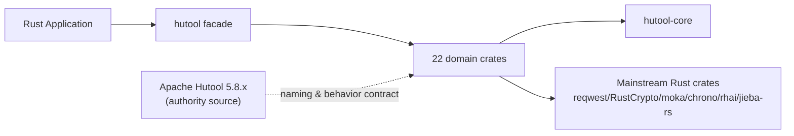
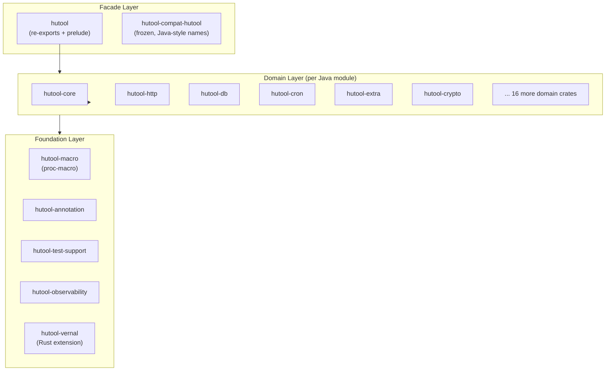

# hutool-rust Architecture

> **Purpose**: Defines the architecture contract for hutool-rust — a Rust multi-purpose utility toolkit migrated 1:1 from Apache Hutool 5.8.x — so that design, development, testing, and release share one verifiable source of truth.
>
> **Architecture version**: 0.1.0<br>
> **Status**: Approved (living document)<br>
> **Owner**: wandl &lt;hiwepy@gmail.com&gt;<br>
> **Last updated**: 2026-08-12

---

## Table of Contents

1. [Document Control & Reading Guide](#1-document-control--reading-guide)
2. [Executive Summary](#2-executive-summary)
3. [Context, Drivers & Constraints](#3-context-drivers--constraints)
4. [Scope & Boundaries](#4-scope--boundaries)
5. [Current State, Target State & Gaps](#5-current-state-target-state--gaps)
6. [Architecture Principles & Key Decisions](#6-architecture-principles--key-decisions)
7. [Overall Architecture & Layering](#7-overall-architecture--layering)
8. [Components, Modules & Dependencies](#8-components-modules--dependencies)
9. [Runtime & Concurrency Model](#9-runtime--concurrency-model)
10. [Interfaces, Protocols & API Alignment](#10-interfaces-protocols--api-alignment)
11. [Configuration, Feature Toggles & Secrets](#11-configuration-feature-toggles--secrets)
12. [Security, Privacy & Trust Boundaries](#12-security-privacy--trust-boundaries)
13. [Reliability, Failure & Recovery](#13-reliability-failure--recovery)
14. [Performance, Capacity & Resource Budget](#14-performance-capacity--resource-budget)
15. [Extension, Plugin & Ecosystem Boundary](#15-extension-plugin--ecosystem-boundary)
16. [Compatibility, Migration & Evolution](#16-compatibility-migration--evolution)
17. [Testing, Verification & Architecture Acceptance](#17-testing-verification--architecture-acceptance)
18. [Risks, Tech Debt & Roadmap](#18-risks-tech-debt--roadmap)
19. [Appendix](#19-appendix)

---

## 1. Document Control & Reading Guide

### 1.1 Document Info

| Field | Value |
|---|---|
| Project | hutool-rust |
| Architecture version | 0.1.0 |
| Applicable code | `HEAD` on `main` (2026-08-12 snapshot) |
| Deployment form | Library (Cargo workspace, not a deployed service) |
| Owner | wandl |
| Status | Approved (living document) |
| Fact-verified date | 2026-08-12 |

### 1.2 Reading Paths

| Reader | Priority sections | What you get |
|---|---|---|
| Application developer | 2, 4, 7, 8, 10, 11 | What to depend on, API surface, feature matrix |
| Contributor / migrator | 3, 6, 8, 16, 17 | Module boundaries, migration rules, test strategy |
| Security reviewer | 4, 12, 15, 16 | Trust boundaries, crypto policy, ecosystem risk |
| Release engineer | 11, 14, 16, 18 | Feature gating, MSRV, SemVer, release blockers |

### 1.3 Implementation Status Labels

| Label | Definition | Required evidence |
|---|---|---|
| ✅ Done | API + behavior aligned with Java, tests green, coverage ≥ 95% | crate path + file count + coverage |
| 🚧 In-Progress | Partial API; structure exists but gaps remain | file count vs Java + gap list |
| 📋 TODO | Trait/skeleton only, no concrete engine | trait definition, missing engine list |
| N/A | Java-specific, no Rust equivalent | rationale |

---

## 2. Executive Summary

hutool-rust is a multi-purpose utility toolkit for Rust, migrated 1:1 in API naming and behavior from Apache Hutool 5.8.x (Java). It is organized as a Cargo workspace of 25 crates behind a single `hutool` facade, letting applications depend on either the facade (ergonomic) or individual domain crates (minimal compile cost).

**One-line architecture**: facade re-exports → domain crates (per Java module) → core contracts & shared primitives → mainstream Rust ecosystem crates (never hand-rolled crypto/parsing/HTTP).

**Key facts** (verified 2026-08-12):
- 25 workspace crates (1 facade + 22 Java-module equivalents + macro/annotation/observability/test-support/vernal/compat extensions)
- Java authority source: 22 modules, ~1553 source files
- Rust: ~1600 source files (core oversized due to dual-path legacy, see §18)
- MSRV 1.94, edition 2024, resolver 3, Apache-2.0
- Default features: `core` + `json`; everything else opt-in
- Fully migrated modules (✅ Done): `hutool-cron`, `hutool-ai`, `hutool-extra`, `hutool-cache`, `hutool-json`, `hutool-aop`, `hutool-bloom-filter`, `hutool-dfa`
- Largest gaps (🚧): `hutool-core` (dual-path cleanup), `hutool-db`, `hutool-http`, `hutool-crypto`

**Migration posture**: Java Hutool is the authority. Rust mirrors Java object/method/parameter names (snake_case for methods/files, PascalCase for types preserved), using idiomatic Rust + mainstream crates for protocol/algorithm engines. No hand-rolled crypto, HTTP, or parsing.

---

## 3. Context, Drivers & Constraints

### 3.1 Background

Apache Hutool is a popular Java utility library (24 modules, ~1553 files) covering core/collections/crypto/db/http/extra/etc. hutool-rust brings the same ergonomic, single-import API surface to the Rust ecosystem, so teams migrating Java services to Rust keep familiar utility names.

### 3.2 Drivers

1. **API parity**: A Java developer reading `CollUtil.newArrayList()` should find `CollUtil::new_array_list()` in Rust with identical semantics.
2. **Idiomatic Rust**: Under the hood, use mature crates (RustCrypto, reqwest, moka, chrono, rhai, jieba-rs) rather than porting Java implementations.
3. **Modular compile**: Applications pay only for what they use — default is `core` + `json`; network/db/crypto are opt-in features.
4. **Test parity**: Behavior verified against Java source via `rust-java-migration-testing` methodology; coverage ≥ 95% (llvm-cov).

### 3.3 Constraints (hard)

| ID | Constraint | Rationale |
|---|---|---|
| C1 | Java Hutool 5.8.x is the single authority for naming & behavior | Migration fidelity |
| C2 | One `.rs` file per Java object; `mod.rs`/`lib.rs` only declares + re-exports | Structural 1:1 alignment |
| C3 | snake_case files/methods, PascalCase types preserved | Rust convention + Java traceability |
| C4 | `thiserror` for checked exceptions, `Option` for null, `Result` for RuntimeException | Java→Rust error mapping |
| C5 | Mainstream ecosystem crates for engines; no hand-rolled crypto/HTTP/parsing | Auditability & maintenance |
| C6 | MSRV 1.94, edition 2024, resolver 3 | Workspace uniformity |
| C7 | Exact-pin dependencies require documented baseline (`dependency-baseline.toml`) | Reproducible builds |
| C8 | `hutool-poi` is out of scope — Excel/Word handled by separate `easyexcel-rust` project | Scope boundary |

---

## 4. Scope & Boundaries

### 4.1 In Scope

- All 22 Java Hutool modules except `hutool-poi` (see C8) and Java-container integrations (`hutool-servlet`, `hutool-spring` — no Rust equivalent).
- A `hutool` facade crate re-exporting domain crates.
- Optional Rust-native extensions: `hutool-observability`, `hutool-vernal` (lunar calendar), `hutool-macro` (proc-macros).

### 4.2 Out of Scope

| Item | Reason | Alternative |
|---|---|---|
| `hutool-poi` (Excel/Word/OFD) | Large standalone domain | `easyexcel-rust` project |
| Spring/Servlet/CGLib integration | JVM container concepts | axum/tower (different paradigm) |
| JCE/JCA provider abstraction | Java security provider model | RustCrypto traits directly |
| SPI (ServiceLoader) auto-discovery | No JVM SPI in Rust | Explicit factory registry |

### 4.3 External Context



---

## 5. Current State, Target State & Gaps

### 5.1 Module Status Matrix (verified 2026-08-12)

| Crate | Java files | Rust files | API coverage | Status |
|---|---:|---:|---|---|
| hutool-core | 713 | 892 | ~83% | 🚧 (dual-path cleanup) |
| hutool-extra | 179 | 92 | 36% → 15 modules integrated | 🚧 |
| hutool-db | 107 | 79 | ~70% | 🚧 |
| hutool-http | 72 | 87 | ~66% | 🚧 |
| hutool-crypto | 70 | 51 | ~60% | 🚧 |
| hutool-cache | 22 | 28 | 100% | ✅ |
| hutool-cron | 41 | 40 | 100% (99.66% line cov) | ✅ |
| hutool-ai | 58 | 28 | 100% (7 providers) | ✅ |
| hutool-json | 33 | 26 | 100% | ✅ |
| hutool-aop | 15 | 21 | 100% | ✅ |
| hutool-bloom-filter | 22 | 6 | 100% | ✅ |
| hutool-dfa | 6 | 14 | 100% | ✅ |
| hutool-jwt | 17 | 28 | ~90% | 🚧 (verify) |
| hutool-captcha | 13 | 19 | ~80% | 🚧 |
| hutool-log | 46 | 29 | ~60% | 🚧 |
| hutool-setting | 16 | 14 | ~80% | 🚧 |
| hutool-socket | 24 | 26 | ~90% | 🚧 (verify) |
| hutool-system | 16 | 25 | ~90% | 🚧 (verify) |
| hutool-script | 5 | 8 | 100% | ✅ |
| hutool-poi | 78 | 0 | N/A | N/A (easyexcel-rust) |

### 5.2 Target State

Every in-scope Java module reaches ✅: API 100% aligned, behavior parity tests green, line coverage ≥ 95%, no dual-path files in `hutool-core` (top-level `src/` ≤ 2 files: `lib.rs` + `prelude.rs`).

---

## 6. Architecture Principles & Key Decisions

### 6.1 Principles

| ID | Principle | Implication |
|---|---|---|
| P1 | **Java is authority** | When in doubt, match Java name/behavior; document deviations |
| P2 | **Facade + opt-in** | One ergonomic entry, but every capability is an independent crate |
| P3 | **Ecosystem over hand-rolled** | Use reqwest/RustCrypto/moka/etc.; never reimplement crypto/HTTP |
| P4 | **Strict dependency direction** | Core ← domain ← facade; no cycles, no domain-to-domain |
| P5 | **Feature-gated cost** | Default minimal; network/db/crypto behind features |
| P6 | **Evidence-based status** | "Done" requires file count + coverage + test parity proof |

### 6.2 Key Decisions (ADR summary)

| Decision | Choice | Alternatives rejected | Rationale |
|---|---|---|---|
| AD1 Workspace layout | One crate per Java module | Monolithic crate | Modular compile + feature gating |
| AD2 Facade | `hutool` re-exports via `pub use` | Trait-based facade | Zero-cost, simple SemVer |
| AD3 Async | tokio (sync API where Java is sync) | async-std/std | Ecosystem breadth (reqwest/sqlx) |
| AD4 Crypto | RustCrypto family | ring/openssl | Trait-based, auditable, covers SM2/SM3/SM4 |
| AD5 Error mapping | `thiserror` enum + `Option`/`Result` | anyhow everywhere | Java checked-exception fidelity |
| AD6 Expression engine | rhai (sync feature) | mlua/deno | Safe sandbox, no C deps |
| AD7 Tokenizer | jieba-rs (feature-gated) | Ansj Java port | Native Rust, matches Java jieba |
| AD8 Cron | `cron` crate + Hutool sentinel layer | hand-rolled parser | Correctness + Java L-sentinel parity |
| AD9 FTP | suppaftp (feature-gated) | hand-rolled | commons-net equivalent |
| AD10 SSH | ssh2/libssh2 (feature-gated) | russh (async) | Matches JSch sync semantics |
| AD11 Template | minijinja (feature-gated) | tera/handlebars | Jinja2 ≈ Velocity/FreeMarker placeholders |

---

## 7. Overall Architecture & Layering

### 7.1 Layered Model



### 7.2 Layer Rules

| Layer | May depend on | May NOT depend on |
|---|---|---|
| Facade | All domain + foundation | (nothing above) |
| Domain | `hutool-core`, foundation, external crates | Other domain crates (no horizontal coupling) |
| Foundation | External crates only | Domain or facade |
| `hutool-core` | `hutool-annotation` (sole exception) | Any other hutool crate |

**Exception**: `hutool-core` depends on `hutool-annotation` (annotation processing is core infrastructure). No other upward dependency exists.

---

## 8. Components, Modules & Dependencies

### 8.1 Workspace Crate Inventory (25)

| Crate | Role | Default | Depends on (hutool) |
|---|---|:---:|---|
| `hutool` | Facade | ✅ | all domain crates |
| `hutool-core` | Core primitives (Str/Coll/Date/IO/ID…) | ✅ (via core feature) | annotation |
| `hutool-annotation` | Annotation abstractions | ✅ (via core feature) | — |
| `hutool-aop` | AOP via trait + aspect + proxy | opt-in | core |
| `hutool-bloom-filter` | Bloom filter | opt-in | core |
| `hutool-cache` | Cache (moka-backed) | opt-in | core |
| `hutool-captcha` | Captcha image generation | opt-in | — |
| `hutool-compat-hutool` | Frozen Java-style compat (deprecated) | — | — |
| `hutool-cron` | Cron parsing + scheduling | opt-in | log |
| `hutool-crypto` | Crypto (RustCrypto) | opt-in | — |
| `hutool-db` | Database (sqlx) | opt-in | json |
| `hutool-dfa` | DFA / sensitive word | opt-in | core |
| `hutool-extra` | Extensions (mail/ftp/ssh/template…) | opt-in | core |
| `hutool-http` | HTTP client (reqwest) | opt-in | json |
| `hutool-json` | JSON (serde_json) | ✅ (default) | core |
| `hutool-jwt` | JWT | opt-in | core |
| `hutool-log` | Logging (tracing) | opt-in | — |
| `hutool-macro` | Proc-macros | (dev/build) | — |
| `hutool-observability` | Metrics/profiling | opt-in | — |
| `hutool-script` | Script (rhai) | opt-in | core |
| `hutool-setting` | Config (config crate) | opt-in | json |
| `hutool-socket` | Socket | opt-in | — |
| `hutool-system` | System info (sysinfo) | opt-in | core |
| `hutool-test-support` | Test helpers | (dev only) | — |
| `hutool-vernal` | Lunar calendar (Rust extension) | opt-in | http |

### 8.2 Dependency Direction Verification

```text
Facade (hutool)
    │
    ▼
Domain crates (http, db, cron, extra, crypto, ...)
    │
    ▼
hutool-core (contracts, primitives)
    │
    ▼
hutool-annotation (sole downward dep of core)
    │
    ▼
External crates (serde, tokio, reqwest, RustCrypto, ...)
```

**Rule**: No domain crate depends on another domain crate. Cross-cutting needs go through `hutool-core` contracts.

---

## 9. Runtime & Concurrency Model

### 9.1 Sync vs Async

| Capability | Model | Rationale |
|---|---|---|
| Core utils (Str/Coll/Date) | Sync | Java is sync |
| HTTP client | Async (reqwest), blocking feature available | Modern Rust default |
| Database | Async (sqlx) | Connection pooling |
| Cron scheduling | Async (tokio) + sync `CronPattern::matches` | Mixed |
| FTP/SSH | Sync (suppaftp/ssh2) | Matches commons-net/JSch sync API |
| Cache | Sync (moka) | Java cache sync |

### 9.2 Concurrency Primitives

- `Arc<RwLock<T>>` / `DashMap` for synchronized maps (mirrors Java `ConcurrentHashMap`).
- `hutool-cache` uses per-key striped locks (`FACTORY_LOCK_STRIPES = 64`) to avoid global lock contention (verified fix).
- `hutool-cron` `TimingWheel` uses `BinaryHeap` with reversed `Ord` for min-heap semantics.
- No `unsafe` in public API (except FFI bindings in ssh2/libssh2 transitive).

---

## 10. Interfaces, Protocols & API Alignment

### 10.1 Naming Contract (Java → Rust)

| Java | Rust | Example |
|---|---|---|
| File name | snake_case | `XlsListSheetListener.java` → `xls_list_sheet_listener.rs` |
| Type name | PascalCase preserved | `CollUtil` → `CollUtil` |
| Method name | snake_case | `loadOrCreate` → `load_or_create` |
| Package | directory | `cn.hutool.core.collection` → `core/collection/` |

See [naming mapping spec](superpowers/specs/2026-08-12-java-rust-naming-mapping-rules.md) for full rules.

### 10.2 Error Mapping

| Java | Rust |
|---|---|
| `null` | `Option<T>` |
| Checked exception | `Result<T, E>` + `thiserror` enum |
| `RuntimeException` | `Result<T, E>` |
| `Optional<T>` | `Option<T>` |

### 10.3 Public API Stability

- Facade re-exports are SemVer-guaranteed.
- Domain crate APIs follow Java signature shape; deviations documented in [object-naming-audit](superpowers/specs/2026-08-12-object-naming-audit.md).
- `#[must_use]` on constructors returning `Self`.

---

## 11. Configuration, Feature Toggles & Secrets

### 11.1 Feature Hierarchy

The `hutool` facade exposes unified features; each maps to one domain crate + optional sub-features.

| Feature | Enables | Default | Cost |
|---|---|:---:|---|
| `core` | hutool-core + hutool-annotation | ✅ | low |
| `json` | hutool-json | ✅ | low |
| `http` | hutool-http (async reqwest) | — | medium (TLS, async) |
| `db` | hutool-db + `db-postgres`/`db-mysql`/`db-sqlite` sub-features | — | high (driver) |
| `crypto` | hutool-crypto (+ `crypto-legacy` for weak algos) | — | medium |
| `extra` | hutool-extra (+ `extra-image`/`extra-mail`/`extra-tokenizer`/`extra-ftp`/`extra-ssh`/`extra-template`) | — | varies |
| `cron` | hutool-cron | — | low |

See facade `Cargo.toml [features]` for the complete matrix (40+ features).

### 11.2 Secrets

- API keys stored via `secrecy::SecretString` (hutool-ai), never logged.
- DB credentials passed through `BaseConfig`, not env vars by default.
- No hardcoded secrets; `dependency-baseline.toml` pins security-sensitive crates (jsonwebtoken, rsa, p256/sm2 group).

---

## 12. Security, Privacy & Trust Boundaries

### 12.1 Crypto Policy

| Category | Default | Restricted | Notes |
|---|---|---|---|
| Recommended | AES-GCM, ChaCha20, Argon2, ECDSA (p256/p384), SM2/SM3/SM4 | — | RustCrypto family |
| Legacy compat | DES, 3DES, RC4, ECB | Behind `crypto-legacy` feature | Decode-only discouraged for new use |
| Weak hashes | MD5, SHA-1 | Available but documented | For checksum/legacy interop |

### 12.2 Input Boundaries

| Boundary | Limit | Enforcement |
|---|---|---|
| HTTP response body | configurable max | `hutool-http` size guard |
| Archive decompression | path traversal + zip bomb | `hutool-extra/archive` validates paths + budgets |
| Expression eval | rhai sandbox | No file/command access by default |
| Streaming SSE | per-event byte limit | `hutool-ai` `StreamEventTooLarge` |

### 12.3 No `unsafe` Policy

Public API contains no `unsafe`. Transitive `unsafe` only in audited FFI (ssh2/libssh2, ring via RustCrypto). See [security baseline](superpowers/specs/2026-08-12-security-baseline.md).

---

## 13. Reliability, Failure & Recovery

### 13.1 Failure Modes

| Component | Failure | Recovery |
|---|---|---|
| Cache factory lock | contention under parallel load | striped locks (64 stripes), verified |
| Cron L-sentinel | mis-expansion (`*/5,L`) | OR-semantics fix + regression tests |
| HTTP timeout | hang on slow server | reqwest timeout + size guard |
| DB pool exhaustion | connection refused | sqlx pool limits |
| SSH/FTP connection | network drop | explicit reconnect via `reconnect_if_timeout` |

### 13.2 Error Propagation

All fallible APIs return `Result<_, E>` where `E: std::error::Error`. No silent panics in public API except where documented (`# Panics` in rustdoc).

---

## 14. Performance, Capacity & Resource Budget

### 14.1 Compile-time Budget

- Default features (`core` + `json`): minimal, no async runtime.
- Full features: tokio + reqwest + sqlx + RustCrypto + image — expect longer compile; documented in feature matrix.
- Workspace deps unified to avoid duplicate major versions (e.g., single `tokio`, single `serde`).

### 14.2 Runtime

- Cache: moka async-friendly, bounded.
- Collections: avoid `clone` in hot paths; `&str` over `String` in API.
- Regex: `regex` crate (linear-time) for most; `fancy-regex` for lookbehind (opt-in).

---

## 15. Extension, Plugin & Ecosystem Boundary

### 15.1 Extension Points

| Extension | Mechanism | Example |
|---|---|---|
| AI provider | `AIServiceProvider` trait + factory registry | DeepSeek/Doubao/Grok/Ollama/Gemini |
| Cron listener | `TaskListener` trait | lifecycle hooks |
| Template engine | `TemplateEngine` trait | MinijinjaEngine (default) |
| Expression engine | `ExpressionEngine` trait | RhaiEngine (default), injectable |
| Tokenizer engine | `TokenizerEngine` trait | JiebaEngine (feature-gated) |

### 15.2 SPI Replacement

Java's `ServiceLoader` is replaced by explicit factory registration (`AIServiceFactory::set_engine`, `ExpressionUtil::set_engine`). No runtime classpath scanning.

---

## 16. Compatibility, Migration & Evolution

### 16.1 Java → Rust Migration Rules

See [naming mapping spec](superpowers/specs/2026-08-12-java-rust-naming-mapping-rules.md) and [migration status baseline](superpowers/specs/2026-08-12-migration-status-baseline.md). Summary:

1. One `.rs` file per Java object.
2. `mod.rs` / `lib.rs` only `mod` + `pub use`.
3. Java checked exception → `thiserror` enum + `Result`.
4. Java null → `Option`.
5. Java SPI → explicit registry.
6. Java container integration (Spring/Servlet) → out of scope.

### 16.2 SemVer

- 0.x: breaking changes allowed between minor versions (pre-1.0).
- Facade re-exports are the stability boundary; domain crate internals may change.
- Exact-pinned deps (`=x.y.z`) documented in `dependency-baseline.toml` with upgrade preconditions.

### 16.3 Evolution

- Target: all in-scope modules reach ✅ (API 100% + cov ≥ 95%).
- `hutool-core` dual-path legacy (top-level `src/*.rs` + subdir) to be consolidated to subdir-only.
- `hutool-compat-hutool` frozen (no further investment until core modules complete).

---

## 17. Testing, Verification & Architecture Acceptance

### 17.1 Test Strategy

| Level | Tooling | Coverage gate |
|---|---|---|
| Unit | `#[test]` in lib | per-module ≥ 95% line (llvm-cov) |
| Parity | `rust-java-migration-testing` skill; behavior tests mirror Java | semantic diff = 0 |
| Mock | mockall (trait mock) + mockall_double (DI) + awaitility (async poll) | network/IO decoupled |
| Doc | rustdoc examples | `cargo test --doc` |

### 17.2 Acceptance Criteria for "Done"

A module is ✅ only when ALL hold:
1. Java API count == Rust public API count (object-naming-audit)
2. Behavior parity tests pass (mirror Java test cases)
3. Line coverage ≥ 95% (llvm-cov)
4. `cargo fmt --check` + `cargo clippy` clean (new code)
5. No `unimplemented!()` / `todo!()` in non-`cfg(test)` code

See [testing coverage spec](superpowers/specs/2026-08-12-testing-coverage-strategy.md).

---

## 18. Risks, Tech Debt & Roadmap

### 18.1 Top Risks

| Risk | Impact | Mitigation |
|---|---|---|
| `hutool-core` dual-path (23 top-level files vs target ≤2) | Confusion, duplicate symbols | Consolidation plan (core-foundations) |
| Java behavior edge cases (cron L-sentinel, pinyin tones) | Wrong runtime behavior | Parity tests + Java diff probes |
| Exact-pin dependency drift | Build break on update | `dependency-baseline.toml` + upgrade preconditions |
| Async/sync API mismatch (FTP/SSH sync vs HTTP async) | Inconsistent ergonomics | Documented per-crate; no forced uniformity |

### 18.2 Tech Debt

- `hutool-core`: ~23 top-level `.rs` files should move into subdirs (legacy from early flat layout).
- `hutool-extra`: API coverage 36% — engines integrated (rhai/jieba/suppaftp/ssh2/minijinja) but many Java helper methods not yet ported.
- `hutool-db/http/crypto`: structure exists, API gaps remain.

### 18.3 Roadmap (summary)

See [Superpowers plans](superpowers/README.md) for the checkbox-tracked execution list. Priority order:
1. Core consolidation (unblock everything)
2. Close gaps in db/http/crypto/extra
3. Verify jwt/socket/system/captcha/log to ✅

---

## 19. Appendix

### 19.1 References

- [Superpowers SDD index](superpowers/README.md) — all plans & specs
- [Dependency baseline](../dependency-baseline.toml) — exact-pin rationale
- [Migration status baseline](superpowers/specs/2026-08-12-migration-status-baseline.md)
- [Naming mapping rules](superpowers/specs/2026-08-12-java-rust-naming-mapping-rules.md)
- [Apache Hutool 5.8.x source](https://github.com/dromara/hutool) — authority

### 19.2 Glossary

| Term | Meaning |
|---|---|
| Facade | `hutool` crate that re-exports domain crates |
| Domain crate | A crate mirroring one Java Hutool module |
| Parity | Identical API name + behavior to Java |
| L-sentinel | Hutool cron DOM value 32 meaning "last day of month" |
| Dual-path | Legacy where a symbol exists both at `src/` top-level and in a subdir |

---

**Document version**: 1.0.0
**Created**: 2026-08-12
**Last updated**: 2026-08-12
**Status**: ✅ Approved (living document)
