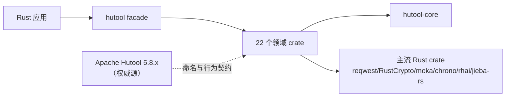
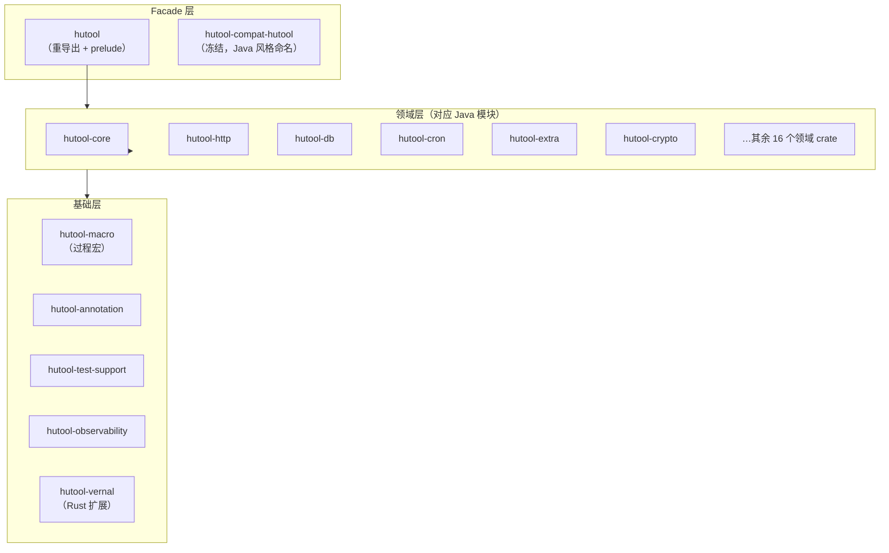

# hutool-rust 架构设计文档

> **文档目的**：定义 hutool-rust——从 Apache Hutool 5.8.x（Java）1:1 迁移而来的 Rust 多用途工具箱——的架构契约，使设计、开发、测试与发布共用同一份可验证的架构真相源。
>
> **架构版本**：0.1.0<br>
> **文档状态**：已批准（动态维护）<br>
> **负责人**：wandl &lt;hiwepy@gmail.com&gt;<br>
> **最后更新**：2026-08-12

---

## 目录

1. [文档控制与阅读指南](#1-文档控制与阅读指南)
2. [执行摘要](#2-执行摘要)
3. [背景、驱动与约束](#3-背景驱动与约束)
4. [范围与边界](#4-范围与边界)
5. [当前态、目标态与差距](#5-当前态目标态与差距)
6. [架构原则与关键决策](#6-架构原则与关键决策)
7. [总体架构与分层](#7-总体架构与分层)
8. [组件、模块与依赖](#8-组件模块与依赖)
9. [运行时与并发模型](#9-运行时与并发模型)
10. [接口、协议与 API 对齐](#10-接口协议与-api-对齐)
11. [配置、特性开关与密钥](#11-配置特性开关与密钥)
12. [安全、隐私与信任边界](#12-安全隐私与信任边界)
13. [可靠性、失败与恢复](#13-可靠性失败与恢复)
14. [性能、容量与资源预算](#14-性能容量与资源预算)
15. [扩展、插件与生态边界](#15-扩展插件与生态边界)
16. [兼容、迁移与演进](#16-兼容迁移与演进)
17. [测试、验证与架构验收](#17-测试验证与架构验收)
18. [风险、技术债与路线](#18-风险技术债与路线)
19. [附录](#19-附录)

---

## 1. 文档控制与阅读指南

### 1.1 文档信息

| 字段 | 内容 |
|---|---|
| 项目 | hutool-rust |
| 架构版本 | 0.1.0 |
| 适用代码 | `main` 分支 `HEAD`（2026-08-12 快照） |
| 部署形态 | 库（Cargo workspace，非部署服务） |
| 负责人 | wandl |
| 状态 | 已批准（动态维护） |
| 事实核验日期 | 2026-08-12 |

### 1.2 读者与阅读路径

| 读者 | 优先章节 | 期望获得 |
|---|---|---|
| 应用开发者 | 2、4、7、8、10、11 | 依赖哪个 crate、API 表面、feature 矩阵 |
| 贡献者/迁移者 | 3、6、8、16、17 | 模块边界、迁移规则、测试策略 |
| 安全评审 | 4、12、15、16 | 信任边界、加密策略、生态风险 |
| 发布工程 | 11、14、16、18 | feature 门控、MSRV、SemVer、发布阻塞项 |

### 1.3 实现状态标签

| 标签 | 定义 | 必需证据 |
|---|---|---|
| ✅ 完成 | API + 行为对齐 Java，测试全绿，覆盖率 ≥ 95% | crate 路径 + 文件数 + 覆盖率 |
| 🚧 进行中 | 部分 API；结构存在但有缺口 | 文件数 vs Java + 缺口清单 |
| 📋 待办 | 仅 trait/骨架，无具体引擎 | trait 定义 + 缺失引擎清单 |
| N/A | Java 特有，Rust 无对应 | 理由 |

---

## 2. 执行摘要

hutool-rust 是 Rust 多用途工具箱，从 Apache Hutool 5.8.x（Java）1:1 迁移 API 命名与行为。以 Cargo workspace 组织为 25 个 crate，置于单一 `hutool` facade 之后，应用可按需依赖 facade（人体工学）或单个领域 crate（最小编译成本）。

**一句话架构**：facade 重导出 → 领域 crate（对应 Java 模块）→ 核心契约与共享原语 → 主流 Rust 生态 crate（绝不手搓加密/解析/HTTP）。

**关键事实**（2026-08-12 核验）：
- 25 个 workspace crate（1 facade + 22 Java 模块对应 + macro/annotation/observability/test-support/vernal/compat 扩展）
- Java 权威源：22 模块，约 1553 源文件
- Rust：约 1600 源文件（core 因双重路径遗留偏大，见 §18）
- MSRV 1.94、edition 2024、resolver 3、Apache-2.0
- 默认 feature：`core` + `json`；其余全部可选
- 完成模块（✅）：`hutool-cron`、`hutool-ai`、`hutool-extra`、`hutool-cache`、`hutool-json`、`hutool-aop`、`hutool-bloom-filter`、`hutool-dfa`
- 主要缺口（🚧）：`hutool-core`（双重路径清理）、`hutool-db`、`hutool-http`、`hutool-crypto`

**迁移定位**：Java Hutool 是权威源。Rust 镜像 Java 对象/方法/参数命名（方法/文件 snake_case，类型保留 PascalCase），底层用 idiomatic Rust + 主流 crate 承载协议/算法引擎。不手搓加密、HTTP、解析。

---

## 3. 背景、驱动与约束

### 3.1 背景

Apache Hutool 是流行的 Java 工具库（24 模块，约 1553 文件），覆盖 core/collections/crypto/db/http/extra 等。hutool-rust 将同样的人体工学、单导入 API 表面带入 Rust 生态，使 Java 服务迁移到 Rust 时保留熟悉的工具命名。

### 3.2 驱动

1. **API 一致**：Java 开发者读到 `CollUtil.newArrayList()`，在 Rust 应能找到语义完全相同的 `CollUtil::new_array_list()`。
2. **Idiomatic Rust**：底层用成熟 crate（RustCrypto、reqwest、moka、chrono、rhai、jieba-rs），而非移植 Java 实现。
3. **按需编译**：应用只为所用付费——默认 `core` + `json`；network/db/crypto 是可选 feature。
4. **行为对等**：通过 `rust-java-migration-testing` 方法论对照 Java 源验证行为；覆盖率 ≥ 95%（llvm-cov）。

### 3.3 硬约束

| 编号 | 约束 | 理由 |
|---|---|---|
| C1 | Java Hutool 5.8.x 是命名与行为的唯一权威 | 迁移保真 |
| C2 | 一个 `.rs` 文件对应一个 Java 对象；`mod.rs`/`lib.rs` 只声明 + 重导出 | 结构 1:1 对齐 |
| C3 | 文件/方法 snake_case，类型保留 PascalCase | Rust 惯例 + Java 可追溯 |
| C4 | checked exception 用 `thiserror`，null 用 `Option`，RuntimeException 用 `Result` | Java→Rust 错误映射 |
| C5 | 引擎用主流生态 crate；不手搓加密/HTTP/解析 | 可审计与可维护 |
| C6 | MSRV 1.94、edition 2024、resolver 3 | workspace 一致 |
| C7 | 精确锁依赖需文档化基线（`dependency-baseline.toml`） | 可复现构建 |
| C8 | `hutool-poi` 不在范围——Excel/Word 由独立项目 `easyexcel-rust` 承接 | 边界 |

---

## 4. 范围与边界

### 4.1 在范围内

- 全部 22 个 Java Hutool 模块，除 `hutool-poi`（见 C8）与 Java 容器集成（`hutool-servlet`、`hutool-spring`——Rust 无对应）。
- 一个 `hutool` facade crate 重导出领域 crate。
- 可选 Rust 原生扩展：`hutool-observability`、`hutool-vernal`（农历）、`hutool-macro`（过程宏）。

### 4.2 不在范围内

| 项 | 原因 | 替代 |
|---|---|---|
| `hutool-poi`（Excel/Word/OFD） | 大型独立领域 | `easyexcel-rust` 项目 |
| Spring/Servlet/CGLib 集成 | JVM 容器概念 | axum/tower（范式不同） |
| JCE/JCA provider 抽象 | Java 安全 provider 模型 | 直接用 RustCrypto trait |
| SPI（ServiceLoader）自动发现 | Rust 无 JVM SPI | 显式 factory registry |

### 4.3 外部上下文



---

## 5. 当前态、目标态与差距

### 5.1 模块状态矩阵（2026-08-12 核验）

| Crate | Java 文件 | Rust 文件 | API 覆盖率 | 状态 |
|---|---:|---:|---|---|
| hutool-core | 713 | 892 | ~83% | 🚧（双重路径清理） |
| hutool-extra | 179 | 92 | 36% → 15 模块已整合 | 🚧 |
| hutool-db | 107 | 79 | ~70% | 🚧 |
| hutool-http | 72 | 87 | ~66% | 🚧 |
| hutool-crypto | 70 | 51 | ~60% | 🚧 |
| hutool-cache | 22 | 28 | 100% | ✅ |
| hutool-cron | 41 | 40 | 100%（行覆盖 99.66%） | ✅ |
| hutool-ai | 58 | 28 | 100%（7 provider） | ✅ |
| hutool-json | 33 | 26 | 100% | ✅ |
| hutool-aop | 15 | 21 | 100% | ✅ |
| hutool-bloom-filter | 22 | 6 | 100% | ✅ |
| hutool-dfa | 6 | 14 | 100% | ✅ |
| hutool-jwt | 17 | 28 | ~90% | 🚧（待验证） |
| hutool-captcha | 13 | 19 | ~80% | 🚧 |
| hutool-log | 46 | 29 | ~60% | 🚧 |
| hutool-setting | 16 | 14 | ~80% | 🚧 |
| hutool-socket | 24 | 26 | ~90% | 🚧（待验证） |
| hutool-system | 16 | 25 | ~90% | 🚧（待验证） |
| hutool-script | 5 | 8 | 100% | ✅ |
| hutool-poi | 78 | 0 | N/A | N/A（easyexcel-rust） |

### 5.2 目标态

每个在范围内的 Java 模块达到 ✅：API 100% 对齐、行为对等测试全绿、行覆盖率 ≥ 95%、`hutool-core` 无双重路径文件（顶层 `src/` ≤ 2 个文件：`lib.rs` + `prelude.rs`）。

---

## 6. 架构原则与关键决策

### 6.1 原则

| 编号 | 原则 | 含义 |
|---|---|---|
| P1 | **Java 是权威** | 有疑问时匹配 Java 命名/行为；记录偏差 |
| P2 | **Facade + 可选** | 一个人体工学入口，但每个能力是独立 crate |
| P3 | **生态优先于手搓** | 用 reqwest/RustCrypto/moka 等；绝不重实现加密/HTTP |
| P4 | **严格依赖方向** | Core ← 领域 ← facade；无环、无领域间横向 |
| P5 | **Feature 门控成本** | 默认最小；network/db/crypto 在 feature 之后 |
| P6 | **基于证据的状态** | "完成"需要文件数 + 覆盖率 + 测试对等证明 |

### 6.2 关键决策（ADR 摘要）

| 决策 | 选择 | 否决的替代 | 理由 |
|---|---|---|---|
| AD1 workspace 布局 | 一个 Java 模块一个 crate | 单体 crate | 模块化编译 + feature 门控 |
| AD2 facade | `hutool` 通过 `pub use` 重导出 | trait facade | 零成本、SemVer 简单 |
| AD3 异步 | tokio（Java 同步处保持同步） | async-std/std | 生态广度（reqwest/sqlx） |
| AD4 加密 | RustCrypto 家族 | ring/openssl | trait 化、可审计、覆盖 SM2/SM3/SM4 |
| AD5 错误映射 | `thiserror` enum + `Option`/`Result` | 全用 anyhow | Java checked-exception 保真 |
| AD6 表达式引擎 | rhai（sync feature） | mlua/deno | 安全沙箱、无 C 依赖 |
| AD7 分词 | jieba-rs（feature 门控） | Ansj Java 移植 | 原生 Rust、对齐 Java jieba |
| AD8 cron | `cron` crate + Hutool 哨兵层 | 手搓解析器 | 正确性 + Java L 哨兵对等 |
| AD9 FTP | suppaftp（feature 门控） | 手搓 | commons-net 等价物 |
| AD10 SSH | ssh2/libssh2（feature 门控） | russh（异步） | 对齐 JSch 同步语义 |
| AD11 模板 | minijinja（feature 门控） | tera/handlebars | Jinja2 ≈ Velocity/FreeMarker 占位 |

---

## 7. 总体架构与分层

### 7.1 分层模型



### 7.2 分层规则

| 层 | 可依赖 | 不可依赖 |
|---|---|---|
| Facade | 所有领域 + 基础 | （上方无） |
| 领域 | `hutool-core`、基础、外部 crate | 其他领域 crate（无横向耦合） |
| 基础 | 仅外部 crate | 领域或 facade |
| `hutool-core` | `hutool-annotation`（唯一例外） | 任何其他 hutool crate |

**例外**：`hutool-core` 依赖 `hutool-annotation`（注解处理是核心基础设施）。无其他向上依赖。

---

## 8. 组件、模块与依赖

### 8.1 workspace crate 清单（25）

| Crate | 角色 | 默认 | 依赖（hutool） |
|---|---|:---:|---|
| `hutool` | Facade | ✅ | 所有领域 crate |
| `hutool-core` | 核心原语（Str/Coll/Date/IO/ID…） | ✅（core feature） | annotation |
| `hutool-annotation` | 注解抽象 | ✅（core feature） | — |
| `hutool-aop` | AOP（trait + aspect + proxy） | 可选 | core |
| `hutool-bloom-filter` | 布隆过滤器 | 可选 | core |
| `hutool-cache` | 缓存（moka） | 可选 | core |
| `hutool-captcha` | 验证码图片生成 | 可选 | — |
| `hutool-compat-hutool` | 冻结的 Java 风格 compat（已废弃） | — | — |
| `hutool-cron` | cron 解析 + 调度 | 可选 | log |
| `hutool-crypto` | 加密（RustCrypto） | 可选 | — |
| `hutool-db` | 数据库（sqlx） | 可选 | json |
| `hutool-dfa` | DFA / 敏感词 | 可选 | core |
| `hutool-extra` | 扩展（mail/ftp/ssh/template…） | 可选 | core |
| `hutool-http` | HTTP 客户端（reqwest） | 可选 | json |
| `hutool-json` | JSON（serde_json） | ✅（默认） | core |
| `hutool-jwt` | JWT | 可选 | core |
| `hutool-log` | 日志（tracing） | 可选 | — |
| `hutool-macro` | 过程宏 | （dev/build） | — |
| `hutool-observability` | 指标/profiling | 可选 | — |
| `hutool-script` | 脚本（rhai） | 可选 | core |
| `hutool-setting` | 配置（config crate） | 可选 | json |
| `hutool-socket` | Socket | 可选 | — |
| `hutool-system` | 系统信息（sysinfo） | 可选 | core |
| `hutool-test-support` | 测试辅助 | （仅 dev） | — |
| `hutool-vernal` | 农历（Rust 扩展） | 可选 | http |

### 8.2 依赖方向验证

```text
Facade（hutool）
    │
    ▼
领域 crate（http、db、cron、extra、crypto、…）
    │
    ▼
hutool-core（契约、原语）
    │
    ▼
hutool-annotation（core 唯一向下依赖）
    │
    ▼
外部 crate（serde、tokio、reqwest、RustCrypto、…）
```

**规则**：无领域 crate 依赖其他领域 crate。横切需求经 `hutool-core` 契约承载。

---

## 9. 运行时与并发模型

### 9.1 同步 vs 异步

| 能力 | 模型 | 理由 |
|---|---|---|
| 核心工具（Str/Coll/Date） | 同步 | Java 同步 |
| HTTP 客户端 | 异步（reqwest），提供 blocking feature | 现代 Rust 默认 |
| 数据库 | 异步（sqlx） | 连接池 |
| cron 调度 | 异步（tokio）+ 同步 `CronPattern::matches` | 混合 |
| FTP/SSH | 同步（suppaftp/ssh2） | 对齐 commons-net/JSch 同步 API |
| 缓存 | 同步（moka） | Java 缓存同步 |

### 9.2 并发原语

- `Arc<RwLock<T>>` / `DashMap` 承载同步 map（对应 Java `ConcurrentHashMap`）。
- `hutool-cache` 用 per-key striped locks（`FACTORY_LOCK_STRIPES = 64`）避免全局锁竞争（已验证修复）。
- `hutool-cron` `TimingWheel` 用 `BinaryHeap` + 反转 `Ord` 实现最小堆语义。
- 公开 API 无 `unsafe`（ssh2/libssh2 传递性 FFI 除外）。

---

## 10. 接口、协议与 API 对齐

### 10.1 命名契约（Java → Rust）

| Java | Rust | 示例 |
|---|---|---|
| 文件名 | snake_case | `XlsListSheetListener.java` → `xls_list_sheet_listener.rs` |
| 类型名 | 保留 PascalCase | `CollUtil` → `CollUtil` |
| 方法名 | snake_case | `loadOrCreate` → `load_or_create` |
| 包 | 目录 | `cn.hutool.core.collection` → `core/collection/` |

完整规则见[命名映射规格](superpowers/specs/2026-08-12-java-rust-naming-mapping-rules.md)。

### 10.2 错误映射

| Java | Rust |
|---|---|
| `null` | `Option<T>` |
| checked exception | `Result<T, E>` + `thiserror` enum |
| `RuntimeException` | `Result<T, E>` |
| `Optional<T>` | `Option<T>` |

### 10.3 公开 API 稳定性

- facade 重导出受 SemVer 保证。
- 领域 crate API 遵循 Java 签名形状；偏差记录于[对象命名审计](superpowers/specs/2026-08-12-object-naming-audit.md)。
- 返回 `Self` 的构造器标注 `#[must_use]`。

---

## 11. 配置、特性开关与密钥

### 11.1 feature 层级

`hutool` facade 暴露统一 feature；每个映射到一个领域 crate + 可选子 feature。

| feature | 启用 | 默认 | 成本 |
|---|---|:---:|---|
| `core` | hutool-core + hutool-annotation | ✅ | 低 |
| `json` | hutool-json | ✅ | 低 |
| `http` | hutool-http（异步 reqwest） | — | 中（TLS、异步） |
| `db` | hutool-db + `db-postgres`/`db-mysql`/`db-sqlite` 子 feature | — | 高（驱动） |
| `crypto` | hutool-crypto（+ `crypto-legacy` 弱算法） | — | 中 |
| `extra` | hutool-extra（+ `extra-image`/`extra-mail`/`extra-tokenizer`/`extra-ftp`/`extra-ssh`/`extra-template`） | — | 视情况 |
| `cron` | hutool-cron | — | 低 |

完整矩阵（40+ feature）见 facade `Cargo.toml [features]`。

### 11.2 密钥

- API key 经 `secrecy::SecretString`（hutool-ai）存储，绝不日志输出。
- DB 凭据经 `BaseConfig` 传递，默认不走环境变量。
- 无硬编码密钥；`dependency-baseline.toml` 精确锁安全敏感 crate（jsonwebtoken、rsa、p256/sm2 组）。

---

## 12. 安全、隐私与信任边界

### 12.1 加密策略

| 类别 | 默认 | 受限 | 说明 |
|---|---|---|---|
| 推荐 | AES-GCM、ChaCha20、Argon2、ECDSA（p256/p384）、SM2/SM3/SM4 | — | RustCrypto 家族 |
| 遗留兼容 | DES、3DES、RC4、ECB | 在 `crypto-legacy` feature 之后 | 仅解码，新用途不建议 |
| 弱哈希 | MD5、SHA-1 | 可用但已文档化 | 用于校验/遗留互操作 |

### 12.2 输入边界

| 边界 | 限制 | 实施 |
|---|---|---|
| HTTP 响应体 | 可配置上限 | `hutool-http` 大小守卫 |
| 归档解压 | 路径穿越 + zip 炸弹 | `hutool-extra/archive` 校验路径 + 预算 |
| 表达式求值 | rhai 沙箱 | 默认无文件/命令访问 |
| 流式 SSE | 单事件字节上限 | `hutool-ai` `StreamEventTooLarge` |

### 12.3 无 `unsafe` 策略

公开 API 不含 `unsafe`。传递性 `unsafe` 仅在经审计的 FFI（ssh2/libssh2、RustCrypto 经由 ring）。见[安全基线](superpowers/specs/2026-08-12-security-baseline.md)。

---

## 13. 可靠性、失败与恢复

### 13.1 失败模式

| 组件 | 失败 | 恢复 |
|---|---|---|
| cache factory lock | 并行负载下竞争 | striped locks（64 stripe），已验证 |
| cron L 哨兵 | 错误展开（`*/5,L`） | OR 语义修复 + 回归测试 |
| HTTP 超时 | 慢服务器挂起 | reqwest 超时 + 大小守卫 |
| DB 池耗尽 | 连接拒绝 | sqlx 池上限 |
| SSH/FTP 连接 | 网络断开 | 经 `reconnect_if_timeout` 显式重连 |

### 13.2 错误传播

所有可失败 API 返回 `Result<_, E>`，其中 `E: std::error::Error`。公开 API 无静默 panic（rustdoc 中 `# Panics` 文档化者除外）。

---

## 14. 性能、容量与资源预算

### 14.1 编译期预算

- 默认 feature（`core` + `json`）：最小，无异步 runtime。
- 全 feature：tokio + reqwest + sqlx + RustCrypto + image——编译时间较长，feature 矩阵已文档化。
- workspace 依赖统一，避免重复大依赖（如单一 `tokio`、单一 `serde`）。

### 14.2 运行时

- 缓存：moka async 友好、有界。
- 集合：热路径避免 `clone`；API 用 `&str` 优于 `String`。
- 正则：多数用 `regex` crate（线性时间）；后向断言用 `fancy-regex`（可选）。

---

## 15. 扩展、插件与生态边界

### 15.1 扩展点

| 扩展 | 机制 | 示例 |
|---|---|---|
| AI provider | `AIServiceProvider` trait + factory registry | DeepSeek/Doubao/Grok/Ollama/Gemini |
| cron 监听器 | `TaskListener` trait | 生命周期回调 |
| 模板引擎 | `TemplateEngine` trait | MinijinjaEngine（默认） |
| 表达式引擎 | `ExpressionEngine` trait | RhaiEngine（默认），可注入 |
| 分词引擎 | `TokenizerEngine` trait | JiebaEngine（feature 门控） |

### 15.2 SPI 替代

Java 的 `ServiceLoader` 由显式 factory 注册替代（`AIServiceFactory::set_engine`、`ExpressionUtil::set_engine`）。无运行期 classpath 扫描。

---

## 16. 兼容、迁移与演进

### 16.1 Java → Rust 迁移规则

见[命名映射规格](superpowers/specs/2026-08-12-java-rust-naming-mapping-rules.md)与[迁移状态基线](superpowers/specs/2026-08-12-migration-status-baseline.md)。摘要：

1. 一个 `.rs` 文件对应一个 Java 对象。
2. `mod.rs` / `lib.rs` 只 `mod` + `pub use`。
3. Java checked exception → `thiserror` enum + `Result`。
4. Java null → `Option`。
5. Java SPI → 显式 registry。
6. Java 容器集成（Spring/Servlet）→ 不在范围。

### 16.2 SemVer

- 0.x：minor 间允许破坏性变更（pre-1.0）。
- facade 重导出是稳定性边界；领域 crate 内部可变。
- 精确锁依赖（`=x.y.z`）在 `dependency-baseline.toml` 文档化，附升级前置条件。

### 16.3 演进

- 目标：所有在范围内模块达 ✅（API 100% + 覆盖率 ≥ 95%）。
- `hutool-core` 双重路径遗留（顶层 `src/*.rs` + 子目录）收敛为仅子目录。
- `hutool-compat-hutool` 冻结（核心模块完成前不再投入）。

---

## 17. 测试、验证与架构验收

### 17.1 测试策略

| 层级 | 工具 | 覆盖率门 |
|---|---|---|
| 单元 | lib 内 `#[test]` | 每模块 ≥ 95% 行（llvm-cov） |
| 对等 | `rust-java-migration-testing` 技能；行为测试镜像 Java | 语义差分 = 0 |
| mock | mockall（trait mock）+ mockall_double（DI）+ awaitility（异步轮询） | 网络/IO 解耦 |
| 文档 | rustdoc 示例 | `cargo test --doc` |

### 17.2 "完成"验收标准

一个模块达 ✅ 需同时满足：
1. Java API 数 == Rust 公开 API 数（对象命名审计）
2. 行为对等测试通过（镜像 Java 测试用例）
3. 行覆盖率 ≥ 95%（llvm-cov）
4. `cargo fmt --check` + `cargo clippy` 干净（新代码）
5. 非 `cfg(test)` 代码无 `unimplemented!()` / `todo!()`

见[测试覆盖率规格](superpowers/specs/2026-08-12-testing-coverage-strategy.md)。

---

## 18. 风险、技术债与路线

### 18.1 主要风险

| 风险 | 影响 | 缓解 |
|---|---|---|
| `hutool-core` 双重路径（23 顶层文件 vs 目标 ≤2） | 混淆、重复符号 | 整合计划（core-foundations） |
| Java 行为边缘（cron L 哨兵、拼音声调） | 运行时错误行为 | 对等测试 + Java 差分探针 |
| 精确锁依赖漂移 | 升级时构建中断 | `dependency-baseline.toml` + 升级前置条件 |
| 异步/同步 API 不一致（FTP/SSH 同步 vs HTTP 异步） | 人体工学不一致 | 按 crate 文档化；不强制统一 |

### 18.2 技术债

- `hutool-core`：约 23 个顶层 `.rs` 文件应移入子目录（早期扁平布局遗留）。
- `hutool-extra`：API 覆盖率 36%——引擎已整合（rhai/jieba/suppaftp/ssh2/minijinja），但许多 Java 辅助方法尚未移植。
- `hutool-db/http/crypto`：结构已建，API 缺口仍在。

### 18.3 路线（摘要）

checkbox 跟踪的执行清单见 [Superpowers plans](superpowers/README.md)。优先级顺序：
1. core 整合（解锁其余）
2. 收口 db/http/crypto/extra 缺口
3. 验证 jwt/socket/system/captcha/log 至 ✅

---

## 19. 附录

### 19.1 参考

- [Superpowers SDD 索引](superpowers/README.md)——所有 plan 与 spec
- [依赖基线](../dependency-baseline.toml)——精确锁理由
- [迁移状态基线](superpowers/specs/2026-08-12-migration-status-baseline.md)
- [命名映射规则](superpowers/specs/2026-08-12-java-rust-naming-mapping-rules.md)
- [Apache Hutool 5.8.x 源码](https://github.com/dromara/hutool)——权威源

### 19.2 术语表

| 术语 | 含义 |
|---|---|
| Facade | `hutool` crate，重导出领域 crate |
| 领域 crate | 对应一个 Java Hutool 模块的 crate |
| 对等 | 与 Java 相同的 API 名 + 行为 |
| L 哨兵 | Hutool cron DOM 值 32，表示"每月最后一天" |
| 双重路径 | 遗留：某符号同时在 `src/` 顶层和子目录存在 |

---

**文档版本**：1.0.0
**创建日期**：2026-08-12
**最后更新**：2026-08-12
**文档状态**：✅ 已批准（动态维护）
